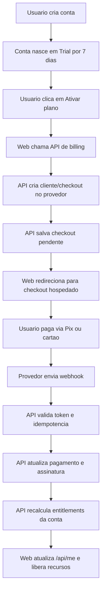
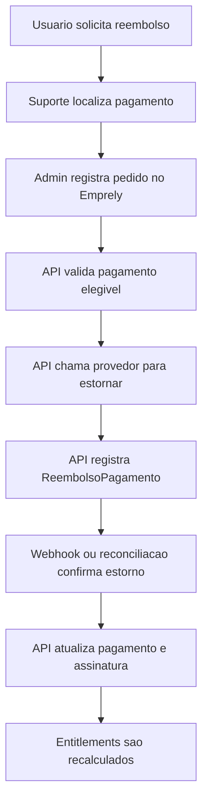

# Sistema de pagamentos e assinaturas do Emprely

Status: documento de arquitetura e produto para consulta.

Data: 2026-05-14.

Escopo: adesao ao Emprely por plano pago, com pagamento por Pix ou cartao de credito, validacao automatica de plano, troca de plano, cancelamento, inadimplencia e reembolso.

Este documento nao implementa a feature. Ele define como a feature deve ser pensada antes da spec e da implementacao.

## 1. Contexto atual

O Emprely hoje ja possui uma base comercial simples:

- Conta nova nasce em `Trial`.
- O trial dura 7 dias.
- O `Plano Fundador` existe no dominio.
- Trial expirado bloqueia gerar, imprimir/PDF, exportar imagem, compartilhar via WhatsApp e marcar proposta como enviada.
- Trial expirado permite login, leitura historica, visualizacao interna com marca d'água grande, criacao de clientes/servicos/rascunhos e duplicacao de propostas.
- A ativacao do `Plano Fundador` e administrativa.
- Nao existe billing real, checkout, assinatura, Pix, cartao, webhook, fatura ou reembolso implementado.

Atualizacao de 2026-05-23: as regras V1 de ciclo de proposta, trial expirado e marca d'água foram implementadas na API e no webapp em `spec/2026-05-23-regras-proposta-trial-watermark.md`. Este documento de billing deve considerar essas regras como base atual do produto.

Arquivos atuais mais relevantes:

- `apps/api/src/Emprely.Domain/Contas/Conta.cs`
- `apps/api/src/Emprely.Domain/Contas/PlanoConta.cs`
- `apps/api/src/Emprely.Domain/Contas/StatusComercialConta.cs`
- `apps/api/src/Emprely.Api/Controllers/AccountController.cs`
- `apps/api/src/Emprely.Api/Controllers/AdminAccountsController.cs`
- `apps/api/src/Emprely.Api/Controllers/ProposalsController.cs`
- `apps/web/src/App.tsx`
- `apps/web/src/lib/api.ts`
- `apps/web/src/types/auth.ts`

Decisao ja tomada anteriormente: checkout/billing real ficou fora do MVP inicial. Esta feature substitui a ativacao manual por um fluxo automatizado e auditavel.

## 2. Objetivo

Permitir que uma pessoa assine o Emprely depois do trial usando Pix ou cartao de credito, com liberacao automatica do plano correto depois da confirmacao de pagamento.

O sistema deve responder com clareza:

- como a pessoa escolhe e paga um plano;
- como o backend valida se a conta pode usar recursos pagos;
- como webhooks de pagamento atualizam o plano;
- como mudar plano;
- como cancelar assinatura;
- como tratar inadimplencia;
- como processar reembolso;
- como auditar tudo que aconteceu.

## 3. Principios

1. O gateway confirma dinheiro; o Emprely libera acesso.
2. Redirecionamento de sucesso do checkout nao libera plano sozinho.
3. Webhook e reconciliacao sao a fonte operacional para atualizar assinatura.
4. A API do Emprely sempre e a autoridade final de permissao.
5. O frontend apenas exibe status e chama a API; nunca decide sozinho se o plano esta ativo.
6. Dados de cartao nao devem passar pelo Emprely no MVP.
7. Toda mudanca comercial deve ser idempotente, auditavel e reversivel quando possivel.
8. Cancelar plano nao apaga dados do cliente.
9. Reembolso nao deve ser apenas financeiro; tambem deve atualizar assinatura, acesso e historico.

## 4. Provedor de pagamento recomendado

Recomendacao inicial para MVP: Asaas Checkout.

Motivos:

- atende mercado brasileiro;
- suporta Pix e cartao;
- possui checkout hospedado;
- possui assinaturas recorrentes;
- possui webhooks;
- possui estorno/reembolso por API;
- reduz escopo de PCI porque o Emprely nao precisa coletar cartao diretamente no MVP.

Fontes oficiais consultadas:

- Asaas Checkout: https://docs.asaas.com/docs/checkout-asaas
- Criar checkout: https://docs.asaas.com/reference/criar-novo-checkout
- Assinaturas: https://docs.asaas.com/docs/subscriptions
- Criar assinatura: https://docs.asaas.com/reference/criar-nova-assinatura
- Webhooks: https://docs.asaas.com/docs/sobre-os-webhooks
- Eventos de cobrancas: https://docs.asaas.com/docs/webhook-para-cobrancas
- Pix: https://docs.asaas.com/docs/cobrancas-via-pix
- Cartao: https://docs.asaas.com/docs/cobrancas-via-cartao-de-credito
- Reembolso/estorno: https://docs.asaas.com/reference/estornar-cobranca
- PCI-DSS: https://docs.asaas.com/docs/pci-dss

Alternativas possiveis:

- Mercado Pago: forte no Brasil, bom para checkout e Pix, mas deve ser avaliado para recorrencia SaaS antes da decisao final.
- Pagar.me: forte em gateway/API, pode ser mais poderoso, mas tende a exigir mais desenho operacional.
- Stripe: excelente para SaaS global, mas a decisao para Pix/recorrencia no Brasil deve ser validada no momento da implementacao.

Decisao arquitetural: criar uma abstracao de provedor, mesmo que o MVP use apenas Asaas.

Nome sugerido para a abstracao:

- `IProvedorPagamentos`
- `AsaasProvedorPagamentos`

O dominio do Emprely nao deve depender de tipos do Asaas.

## 5. Escopo do MVP de pagamentos

Entra:

- listar planos disponiveis;
- contratar plano por Pix;
- contratar plano por cartao de credito;
- criar checkout hospedado no provedor;
- receber webhook de pagamento;
- ativar plano depois da confirmacao correta;
- exibir status de assinatura no web;
- bloquear recursos quando trial expirar ou pagamento falhar;
- cancelar assinatura;
- registrar mudanca de plano;
- registrar reembolso manual/processado;
- reconciliar pagamentos para cobrir falha de webhook;
- logs e auditoria minima.

Fora do MVP:

- nota fiscal automatica;
- split de pagamento;
- boleto, salvo se decidido depois;
- multiplos gateways ativos em producao;
- carteira interna;
- cupom complexo;
- prorata sofisticada;
- app mobile nativo de pagamentos;
- checkout transparente com cartao digitado dentro do Emprely;
- suporte automatico a chargeback alem do registro e bloqueio operacional.

## 6. Modelo comercial sugerido

### 6.1 Planos iniciais

Plano `Trial`:

- preco: R$ 0;
- duracao: 7 dias;
- objetivo: experimentar o produto;
- marca d'agua: sim;
- apos expirar: bloqueia gerar/exportar/compartilhar propostas.

Plano `Fundador`:

- preco atual usado no MVP: R$ 19,90 mensal;
- marca d'agua: nao;
- acesso: recursos comerciais principais;
- forma de pagamento: Pix ou cartao;
- renovacao: mensal.

Planos futuros:

- `Pro`;
- `Anual`;
- planos com limite por volume;
- planos com equipe/membros.

Recomendacao: mesmo que exista apenas um plano pago no inicio, criar tabela de catalogo de planos. Evita preco hardcoded duplicado.

### 6.2 Entitlements

O acesso deve ser expresso por permissoes de negocio, nao apenas pelo nome do plano.

Exemplos:

- `canGenerateProposta`
- `canExportProposta`
- `canSharePropostaWhatsapp`
- `canRemoveWatermark`
- `maxUsuarios`
- `maxPropostasMes`
- `canUseTemplatesPremium`

No MVP, algumas permissoes podem ser fixas por plano, mas a API deve expor isso de forma centralizada.

## 7. Estados comerciais

Estados atuais:

- `TrialAtivo`
- `TrialExpirado`
- `FundadorAtivo`

Estados necessarios para billing real:

- `TrialAtivo`
- `TrialExpirado`
- `AguardandoPagamento`
- `PagamentoEmAnalise`
- `Ativo`
- `Inadimplente`
- `CancelamentoAgendado`
- `Cancelado`
- `Suspenso`
- `Reembolsado`

Sugestao de separacao:

- `PlanoConta`: qual plano comercial esta associado.
- `StatusAssinaturaConta`: situacao operacional da assinatura.
- `Entitlements`: o que a conta pode fazer agora.

Nao usar apenas `PlanoConta` para decidir acesso. Uma conta pode estar no plano pago, mas inadimplente ou cancelada.

## 8. Modelo de dados proposto

### 8.1 `PlanoComercial`

Representa o catalogo interno de planos.

Campos sugeridos:

- `Id`
- `Codigo`
- `Nome`
- `Descricao`
- `PrecoMensal`
- `PrecoAnual`
- `Moeda`
- `Ativo`
- `OrdemExibicao`
- `PermissoesJson`
- `CreatedAt`
- `UpdatedAt`

### 8.2 `AssinaturaConta`

Representa a assinatura da conta no Emprely.

Campos sugeridos:

- `Id`
- `ContaId`
- `PlanoComercialId`
- `Provedor`
- `ProviderCustomerId`
- `ProviderSubscriptionId`
- `Status`
- `BillingType`
- `Ciclo`
- `Valor`
- `Moeda`
- `PeriodoAtualInicio`
- `PeriodoAtualFim`
- `CancelAtPeriodEnd`
- `CanceladaAt`
- `MotivoCancelamento`
- `UltimoPagamentoId`
- `CreatedAt`
- `UpdatedAt`

Indices importantes:

- unico por `ProviderSubscriptionId` quando preenchido;
- indice por `ContaId`;
- indice por `Status`;
- indice por `PeriodoAtualFim`.

### 8.3 `PagamentoConta`

Representa cada cobranca/fatura/transacao ligada a uma assinatura.

Campos sugeridos:

- `Id`
- `ContaId`
- `AssinaturaContaId`
- `PlanoComercialId`
- `Provedor`
- `ProviderPaymentId`
- `ProviderCheckoutId`
- `ProviderSubscriptionId`
- `ExternalReference`
- `Status`
- `BillingType`
- `Valor`
- `Moeda`
- `DueDate`
- `ConfirmedAt`
- `PaidAt`
- `OverdueAt`
- `RefundedAt`
- `RefundedAmount`
- `InvoiceUrl`
- `PixQrCodePayload`
- `CreatedAt`
- `UpdatedAt`

### 8.4 `EventoWebhookPagamento`

Garante idempotencia e auditoria.

Campos sugeridos:

- `Id`
- `Provedor`
- `ProviderEventId`
- `TipoEvento`
- `ProviderResourceId`
- `ContaId`
- `PagamentoContaId`
- `AssinaturaContaId`
- `RecebidoAt`
- `ProcessadoAt`
- `StatusProcessamento`
- `PayloadJson`
- `ErroProcessamento`

Indice obrigatorio:

- unico por `Provedor + ProviderEventId`.

### 8.5 `ReembolsoPagamento`

Registra pedido e execucao de reembolso.

Campos sugeridos:

- `Id`
- `ContaId`
- `PagamentoContaId`
- `Provedor`
- `ProviderRefundId`
- `Valor`
- `Motivo`
- `Status`
- `SolicitadoPorUsuarioId`
- `AprovadoPorUsuarioId`
- `SolicitadoAt`
- `ProcessadoAt`
- `ConcluidoAt`
- `PayloadJson`

### 8.6 `HistoricoAssinaturaConta`

Auditoria legivel de mudancas comerciais.

Eventos exemplos:

- `TrialStarted`
- `CheckoutCreated`
- `PaymentConfirmed`
- `PaymentReceived`
- `SubscriptionActivated`
- `PaymentFailed`
- `SubscriptionPastDue`
- `PlanChanged`
- `CancelScheduled`
- `SubscriptionCanceled`
- `RefundRequested`
- `RefundDone`
- `AccessSuspended`
- `AccessRestored`

## 9. Fluxo ponta a ponta de adesao

Regra critica: a tela de retorno do checkout mostra "aguardando confirmacao" ate a API confirmar que o webhook foi processado ou que a reconciliacao encontrou pagamento confirmado.

## 10. Fluxo de cadastro e trial

1. Usuario acessa cadastro.
2. Usuario informa nome, email, telefone, senha e nome da conta.
3. API cria:
   - usuario;
   - conta;
   - membro owner;
   - perfil de conta;
   - trial tecnico de 7 dias.
4. Web salva sessao.
5. Dashboard mostra dias restantes do trial.
6. CTAs de upgrade aparecem:
   - dashboard;
   - preview/exportacao de proposta;
   - tela de conta/cobranca;
   - aviso de trial proximo do fim.

Nao pedir cartao no cadastro no MVP. Isso reduz friccao e preserva a proposta atual do produto.

## 11. Fluxo de contratacao por cartao

Recomendacao MVP: cartao via checkout hospedado do provedor.

1. Usuario escolhe plano.
2. Web chama `POST /api/billing/checkouts`.
3. API valida usuario, conta e plano.
4. API cria ou reutiliza customer no provedor.
5. API cria checkout recorrente com `billingTypes = CREDIT_CARD` ou `CREDIT_CARD + PIX`, conforme decisao de produto.
6. API salva o checkout como `AguardandoPagamento`.
7. Web redireciona usuario para a URL do checkout.
8. Usuario paga no ambiente do provedor.
9. Provedor envia webhook.
10. API processa:
    - `PAYMENT_CONFIRMED` em cartao deve liberar acesso;
    - `PAYMENT_RECEIVED` registra recebimento financeiro, mas nao deve ser necessario esperar este evento para liberar acesso em cartao, porque o recebimento no saldo pode ocorrer dias depois.
11. API atualiza assinatura para `Ativo`.
12. Web invalida sessao local e recarrega `/api/me`.

Motivo para nao esperar `PAYMENT_RECEIVED` no cartao: em gateways como Asaas, o pagamento por cartao pode ficar confirmado antes de o valor estar disponivel no saldo. Esperar o recebimento financeiro faria o usuario pagar e continuar bloqueado.

## 12. Fluxo de contratacao por Pix

1. Usuario escolhe plano.
2. Web chama API para criar checkout.
3. API cria checkout ou cobranca Pix.
4. Usuario visualiza QR Code/copia e cola no checkout hospedado.
5. Enquanto o Pix nao for pago:
   - assinatura fica `AguardandoPagamento`;
   - plano pago ainda nao libera recursos;
   - web mostra estado pendente.
6. Ao receber webhook de Pix pago:
   - `PAYMENT_RECEIVED` libera acesso;
   - pagamento vira `Pago`;
   - assinatura vira `Ativo`;
   - entitlements sao recalculados.
7. Web atualiza status por polling leve ou refresh da sessao.

Regra: Pix pendente nao ativa plano. Apenas pagamento confirmado/recebido pelo provedor ativa.

## 13. Webhooks

### 13.1 Endpoint

Endpoint sugerido:

- `POST /api/webhooks/asaas`

Caracteristicas:

- nao usa JWT do usuario;
- valida token/cabecalho do provedor;
- valida payload;
- registra evento bruto;
- aplica idempotencia;
- responde `200` rapido;
- processa evento de forma segura.

### 13.2 Idempotencia

Webhooks podem chegar mais de uma vez. O Emprely deve:

1. ler `ProviderEventId`;
2. tentar inserir em `EventoWebhookPagamento`;
3. se ja existir, responder `200` e ignorar;
4. se for novo, processar.

Nunca processar o mesmo evento duas vezes.

### 13.3 Eventos minimos

Para cobrancas:

- `PAYMENT_CREATED`
- `PAYMENT_AWAITING_RISK_ANALYSIS`
- `PAYMENT_APPROVED_BY_RISK_ANALYSIS`
- `PAYMENT_REPROVED_BY_RISK_ANALYSIS`
- `PAYMENT_CONFIRMED`
- `PAYMENT_RECEIVED`
- `PAYMENT_OVERDUE`
- `PAYMENT_DELETED` ou equivalente, se aplicavel
- `PAYMENT_REFUNDED` ou leitura de refund no pagamento, conforme provedor

Para checkout:

- `CHECKOUT_CREATED`
- `CHECKOUT_CANCELED`
- `CHECKOUT_EXPIRED`
- `CHECKOUT_PAID`

Observacao: no Asaas, a assinatura em si e acompanhada por cobrancas. O documento oficial indica que a gestao deve acompanhar webhooks de cobranca, usando o identificador de assinatura presente na cobranca.

### 13.4 Eventos fora de ordem

O sistema deve aceitar eventos fora de ordem.

Exemplo:

- `PAYMENT_RECEIVED` chega antes de `PAYMENT_CREATED`.

Nesse caso:

- criar ou atualizar `PagamentoConta` pelo `ProviderPaymentId`;
- marcar como pago;
- vincular assinatura se houver `ProviderSubscriptionId`;
- registrar historico.

### 13.5 Falhas

Se o processamento falhar:

- registrar erro em `EventoWebhookPagamento`;
- nao perder payload;
- responder conforme estrategia:
  - se ainda nao registrou o evento, pode responder erro para retry do provedor;
  - se registrou e vai reprocessar internamente, responder `200` e colocar em fila interna.

No MVP simples, a API pode processar sincrono, mas a arquitetura deve permitir job/fila depois.

## 14. Reconciliacao

Webhooks nao podem ser o unico mecanismo de verdade operacional.

Criar job diario ou manual para:

- buscar pagamentos recentes no provedor;
- comparar com `PagamentoConta`;
- detectar checkout pago sem webhook processado;
- detectar assinatura cancelada/inadimplente no provedor;
- corrigir status local;
- gerar alerta se houver divergencia.

Esse job e especialmente importante porque provedores podem pausar fila de webhook se o endpoint falhar repetidamente.

## 15. Validacao de plano e bloqueio de recursos

### 15.1 Backend

A API deve centralizar regra de acesso em um servico de entitlement.

Nome sugerido:

- `EntitlementsContaService`
- `GetEntitlementsContaAsync`
- `CanGeneratePropostaAsync`

O `ProposalsController` nao deve decidir com regra local duplicada. Ele deve consultar o servico.

### 15.2 Frontend

O web deve usar status retornado pela API.

Mudancas necessarias:

- criar area `Plano e cobranca`;
- criar CTA `Ativar plano`;
- criar tela/estado de `Aguardando confirmacao`;
- invalidar `/api/me` apos retorno do checkout;
- nao confiar no `localStorage` como estado final do plano;
- atualizar a conta depois de webhook/polling.

Risco atual: o web guarda `conta` no `localStorage`. Se webhook muda o plano, a interface pode continuar mostrando o plano antigo ate nova sincronizacao. A feature precisa corrigir isso.

## 16. Fluxo de retorno do checkout

Rotas sugeridas no web:

- `/billing/sucesso`
- `/billing/cancelado`
- `/billing/expirado`

Com SPA atual, pode ser controlado por view interna ou query string.

Tela de sucesso:

- nao dizer "plano ativo" imediatamente;
- dizer "Pagamento enviado. Estamos confirmando com o provedor.";
- fazer polling em `GET /api/billing/status`;
- quando status virar `Ativo`, mostrar "Plano ativo" e CTA para voltar ao app.

Tela cancelada:

- manter trial ou status anterior;
- permitir tentar novamente.

Tela expirada:

- informar que o link expirou;
- criar novo checkout.

## 17. Alteracao de plano

Como o Emprely inicialmente tem um plano pago, a troca real de plano pode ser preparada para futuro.

Regras recomendadas:

### 17.1 Upgrade

- Upgrade libera recursos somente apos pagamento confirmado.
- Se houver diferenca de preco, criar nova cobranca/checkout.
- No MVP, evitar prorata automatica.
- Registrar alteracao em historico.

### 17.2 Downgrade

- Downgrade deve valer no fim do periodo ja pago.
- Nao remover acesso imediatamente se o cliente ja pagou o ciclo atual.
- Agendar mudanca com `PlanoAgendadoId` e `EfetivarEm`.

### 17.3 Troca de mensal para anual

- Pode ser tratada como upgrade com checkout novo.
- O plano anual comeca apos pagamento confirmado.
- Cancelar a recorrencia antiga para evitar cobranca dupla.

### 17.4 Troca de forma de pagamento

- Cartao para Pix:
  - cancelar/encerrar recorrencia de cartao no fim do periodo;
  - criar proxima cobranca Pix.
- Pix para cartao:
  - criar checkout/cartao recorrente;
  - ativar recorrencia no pagamento confirmado.

Regra: nunca deixar duas assinaturas ativas cobrando a mesma conta sem registro explicito de transicao.

## 18. Cancelamento

### 18.1 Cancelamento pelo usuario

Fluxo:

1. Usuario acessa `Plano e cobranca`.
2. Clica em `Cancelar plano`.
3. Sistema explica:
   - ate quando tera acesso;
   - o que sera bloqueado depois;
   - que os dados nao serao apagados.
4. Usuario confirma.
5. API agenda cancelamento no fim do periodo.
6. API atualiza assinatura com `CancelAtPeriodEnd = true`.
7. API chama provedor para encerrar recorrencia futura.
8. Web mostra `CancelamentoAgendado`.

Regra: por padrao, cancelamento nao gera reembolso automatico.

### 18.2 Cancelamento imediato

Permitido apenas para suporte/admin ou casos de risco:

- fraude;
- chargeback;
- abuso;
- pedido de reembolso integral aprovado;
- erro operacional.

Nesse caso:

- cancelar assinatura no provedor;
- suspender entitlements;
- registrar motivo.

## 19. Inadimplencia

Estados sugeridos:

- `AguardandoPagamento`: checkout/cobranca criada, ainda nao paga.
- `PagamentoEmAnalise`: cartao em analise de risco.
- `Inadimplente`: cobranca vencida ou falha recorrente.
- `Suspenso`: acesso pago bloqueado apos periodo de tolerancia.

Regra recomendada:

- Pix nao pago ate vencimento: manter trial/status anterior; se ja era assinante, entrar em tolerancia.
- Cartao recusado na renovacao: manter acesso por periodo curto de tolerancia.
- Apos tolerancia, bloquear recursos pagos, mas manter login e acesso a historico.

Periodo de tolerancia sugerido:

- 3 dias para falha de renovacao;
- 0 dias para primeira contratacao que nunca foi paga;
- configuravel por ambiente.

## 20. Reembolso

### 20.1 Politica recomendada

Definir uma politica clara antes da implementacao. Sugestao inicial:

- reembolso pode ser solicitado pelo usuario via suporte;
- primeira cobranca pode ser reembolsada em ate 7 dias corridos, sujeito a validacao operacional;
- cobrancas recorrentes futuras devem ser evitadas por cancelamento;
- reembolso parcial deve ser permitido somente por admin;
- reembolso nao deve apagar dados.

Observacao: regras legais e fiscais devem ser confirmadas com contabilidade/juridico antes de producao.

### 20.2 Fluxo de reembolso

### 20.3 Reembolso integral

Se reembolso integral do periodo atual:

- pagamento vira `Reembolsado`;
- assinatura pode ser `Cancelada` ou `Suspensa`;
- entitlements pagos sao removidos, salvo decisao comercial contraria;
- historico fica preservado.

### 20.4 Reembolso parcial

Se reembolso parcial:

- assinatura pode continuar ativa;
- registrar valor reembolsado;
- nao alterar entitlements automaticamente, exceto se admin escolher.

### 20.5 Reembolso fora do provedor

Evitar.

Se ocorrer por transferencia manual:

- registrar em `ReembolsoPagamento`;
- marcar como `Manual`;
- anexar comprovante/referencia;
- atualizar assinatura conforme politica.

## 21. Contratos de API sugeridos

Endpoints autenticados:

- `GET /api/billing/plans`
- `GET /api/billing/status`
- `GET /api/billing/invoices`
- `POST /api/billing/checkouts`
- `POST /api/billing/change-plan`
- `POST /api/billing/cancel`
- `POST /api/billing/reactivate`
- `POST /api/billing/payment-method`

Endpoints de webhook:

- `POST /api/webhooks/asaas`

Endpoints administrativos:

- `GET /api/admin/billing/accounts/{contaId}`
- `POST /api/admin/billing/accounts/{contaId}/refunds`
- `POST /api/admin/billing/accounts/{contaId}/sync`
- `POST /api/admin/billing/accounts/{contaId}/suspend`
- `POST /api/admin/billing/accounts/{contaId}/restore`

## 22. Contratos de resposta importantes

### 22.1 Status de billing

O web precisa receber:

- plano atual;
- status comercial;
- status da assinatura;
- dias restantes do trial;
- periodo atual;
- proxima cobranca;
- metodo de pagamento;
- se ha cancelamento agendado;
- entitlements;
- CTA recomendado;
- mensagem humana curta.

### 22.2 Checkout

Ao criar checkout, a API deve retornar:

- `checkoutId` interno;
- `providerCheckoutId`;
- `checkoutUrl`;
- `expiresAt`;
- `status`;
- `plano`;
- `valor`;
- `billingTypes`.

## 23. Impactos por projeto

### 23.1 `apps/api`

Maior impacto.

Mudancas:

- novas entidades de billing;
- migrations;
- controllers de billing;
- controller de webhook;
- servico de entitlements;
- provedor de pagamento na Infrastructure;
- jobs de reconciliacao;
- testes unitarios e integracao;
- configuracao de secrets.

### 23.2 `apps/web`

Impacto alto.

Mudancas:

- tela `Plano e cobranca`;
- CTA de contratacao em trial/bloqueios;
- retorno de checkout;
- polling de status;
- refresh de `/api/me`;
- atualizacao dos tipos de conta/plano;
- centralizacao de `canUseFeature`.

### 23.3 `apps/mobile`

Impacto futuro.

O app mobile ainda e placeholder. Quando existir:

- deve consumir os mesmos endpoints;
- deve abrir checkout externo;
- deve retornar ao app por deep link;
- nao deve implementar regra propria de plano.

### 23.4 `packages/shared-types`

Impacto medio.

O tipo atual `PlanoAssinatura = "trial" | "founder" | "pro"` nao esta alinhado com API/web, que usam `Trial` e `Fundador`.

Antes da implementacao, decidir:

- manter enum em portugues no backend e mapear para frontend;
- ou padronizar codigos estaveis sem depender do texto de exibicao.

Recomendacao:

- codigo tecnico: `trial`, `fundador`, `pro`;
- label exibido: `Trial`, `Fundador`, `Pro`.

### 23.5 `infra`

Impacto medio.

Novas variaveis:

- `Billing__Provider`
- `Billing__PublicBaseUrl`
- `Asaas__BaseUrl`
- `Asaas__ApiKey`
- `Asaas__WebhookToken`
- `Asaas__WebhookEmail`
- `Asaas__CheckoutSuccessUrl`
- `Asaas__CheckoutCancelUrl`
- `Asaas__CheckoutExpiredUrl`
- `Billing__GracePeriodDays`

Nao commitar secrets reais.

### 23.6 Landing

Impacto comercial.

A landing real vive fora deste monorepo. Quando billing estiver pronto, precisa atualizar:

- precos;
- CTA para app/cadastro;
- explicacao de trial;
- politica de cancelamento/reembolso.

## 24. UX esperada

### 24.1 Durante trial

Mensagens:

- "Voce esta no teste de 7 dias."
- "Depois do teste, escolha um plano para continuar gerando e enviando propostas."
- CTA: "Ativar plano".

### 24.2 Trial expirado

Mensagem:

- "Seu teste expirou. Ative o plano para gerar, exportar e compartilhar propostas."

Acoes liberadas:

- login;
- ver historico;
- editar proposta `Rascunho`;
- editar proposta `Gerada`, com aviso de retorno para `Rascunho` ao salvar;
- duplicar proposta nao arquivada;
- criar clientes, servicos e propostas rascunho;
- visualizar proposta internamente com marca d'água grande;
- acessar cobranca;
- ativar plano.

Acoes bloqueadas:

- gerar proposta;
- exportar PDF/imagem;
- compartilhar via WhatsApp;
- marcar proposta como enviada.
- editar diretamente proposta `Enviada`, `Aceita` ou `Recusada`.

### 24.3 Pagamento pendente

Mensagem:

- "Estamos aguardando a confirmacao do pagamento."

Para Pix:

- exibir que a liberacao ocorre apos pagamento do QR Code.

Para cartao:

- exibir analise se houver risco/validacao.

### 24.4 Plano ativo

Mensagem:

- "Plano ativo."

Mostrar:

- plano;
- valor;
- proxima renovacao;
- metodo de pagamento;
- historico de pagamentos.

### 24.5 Falha de pagamento

Mensagem:

- "Nao conseguimos confirmar sua renovacao. Atualize o pagamento para manter o acesso."

CTA:

- "Regularizar pagamento"
- "Trocar forma de pagamento"

## 25. Seguranca e conformidade

Regras obrigatorias:

- API key do provedor somente no backend.
- Nunca salvar numero de cartao, CVV ou dados sensiveis de cartao no Emprely.
- Preferir checkout hospedado.
- Webhook deve validar token/cabecalho.
- Webhook deve usar HTTPS em producao.
- Payload bruto deve ser protegido porque pode conter dados pessoais.
- Logs nao devem imprimir API key, token, dados completos de cartao ou documentos.
- Operacoes admin exigem chave/role administrativo.
- Toda alteracao de assinatura precisa de auditoria.

Sobre PCI:

- checkout hospedado reduz escopo;
- checkout transparente e tokenizacao server-side aumentam responsabilidade;
- se cartao passar pelo backend, a exigencia de conformidade cresce muito.

## 26. Observabilidade

Metricas importantes:

- checkouts criados;
- checkouts expirados;
- pagamentos confirmados;
- pagamentos falhos;
- tempo medio ate ativacao;
- webhooks recebidos;
- webhooks duplicados;
- webhooks com erro;
- reconciliacoes com divergencia;
- cancelamentos;
- reembolsos.

Logs importantes:

- `checkout_created`;
- `payment_webhook_received`;
- `payment_webhook_duplicate`;
- `subscription_activated`;
- `subscription_past_due`;
- `subscription_canceled`;
- `refund_requested`;
- `refund_done`;
- `billing_reconciliation_divergence`.

Alertas:

- webhook sem eventos por periodo anormal;
- webhook com erro repetido;
- pagamento recebido sem conta vinculada;
- assinatura ativa no provedor e cancelada localmente;
- assinatura ativa localmente e cancelada no provedor;
- quantidade alta de cartoes recusados.

## 27. Testes obrigatorios

### 27.1 Unitarios

- trial ativo libera recursos esperados;
- trial expirado bloqueia recursos esperados;
- pagamento confirmado ativa assinatura;
- Pix pendente nao ativa;
- cartao em analise nao ativa;
- cancelamento agendado mantem acesso ate fim do periodo;
- cancelamento imediato remove acesso;
- reembolso integral remove acesso conforme politica;
- webhook duplicado nao duplica pagamento;
- evento fora de ordem nao quebra estado.

### 27.2 Integracao API

- criar checkout autenticado;
- rejeitar checkout para plano inexistente;
- processar webhook valido;
- rejeitar webhook com token invalido;
- processar webhook duplicado com 200 sem efeito colateral;
- atualizar `/api/me` com novo status;
- bloquear `generate/send/export` quando inadimplente.

### 27.3 Web

- trial mostra CTA de plano;
- checkout redireciona;
- retorno de sucesso mostra aguardando confirmacao;
- status ativo libera recursos;
- trial expirado bloqueia botoes certos;
- `localStorage` nao mantem plano antigo depois de refresh de `/api/me`;
- UI mobile mostra CTA claro.

### 27.4 Sandbox

- pagar Pix em sandbox;
- pagar cartao aprovado;
- simular cartao recusado;
- simular webhook duplicado;
- simular checkout expirado;
- simular reembolso.

## 28. Estrategia de implementacao

### Fase 1: SDD e decisao final

- Criar analise SDD especifica.
- Fazer perguntas de negocio.
- Fechar provedor.
- Fechar planos/precos.
- Fechar politica de reembolso.
- Fechar periodo de tolerancia.

### Fase 2: Dominio interno

- Criar entidades de billing.
- Criar migrations.
- Criar entitlements.
- Remover preco hardcoded duplicado.
- Manter compatibilidade com `PlanoConta` atual durante transicao.

### Fase 3: API sem provedor real

- Criar endpoints de billing.
- Criar provedor fake para testes.
- Validar fluxos com testes automatizados.

### Fase 4: Integracao Asaas sandbox

- Criar client Asaas na Infrastructure.
- Criar checkout.
- Receber webhook.
- Processar Pix/cartao.
- Criar reconciliacao.

### Fase 5: Web

- Criar tela de plano/cobranca.
- Criar CTA de upgrade.
- Criar retorno de checkout.
- Corrigir sync de sessao/plano.

### Fase 6: Operacao e suporte

- Criar endpoints/admin docs para reembolso.
- Criar runbook de suporte.
- Criar checklist de sandbox/producao.
- Criar alertas.

### Fase 7: Producao controlada

- Habilitar para contas internas.
- Testar pagamento real pequeno.
- Testar reembolso real.
- Acompanhar logs.
- Liberar gradualmente.

## 29. Migracao do Plano Fundador manual

Contas ja ativadas manualmente como `Fundador` precisam de decisao.

Opcoes:

1. Manter como legado vitalicio.
2. Migrar para assinatura paga com data futura.
3. Manter ativo ate uma data de corte e solicitar pagamento.

Recomendacao: nao migrar automaticamente sem comunicacao. Criar status `FundadorLegado` ou campo de origem da assinatura:

- `Origem = ManualAdmin`
- `Origem = Checkout`
- `Origem = Migracao`

Isso evita confundir clientes beta com cobranca inesperada.

## 30. Riscos

Riscos tecnicos:

- webhook duplicado gerar cobranca/ativacao duplicada;
- webhook fora de ordem sobrescrever estado mais novo;
- plano ficar stale no frontend por causa do `localStorage`;
- falta de reconciliacao deixar cliente pago bloqueado;
- segredo do provedor vazar;
- dados sensiveis aparecerem em logs;
- controller ficar acoplado ao Asaas.

Riscos de produto:

- liberar acesso antes do pagamento real;
- bloquear cliente pagante por atraso de webhook;
- politica de reembolso ambigua;
- migrar Fundador manual sem comunicacao;
- prometer Pix recorrente sem validar comportamento exato do provedor.

Riscos financeiros/operacionais:

- chargeback de cartao;
- taxas do provedor afetarem margem;
- tempo de liquidacao diferente por metodo;
- suporte receber pedido de reembolso sem ferramenta;
- nota fiscal ficar descoberta se exigida na operacao.

## 31. Decisoes pendentes

Antes da spec, responder:

1. O provedor do MVP sera Asaas?
2. O Plano Fundador continuara sendo o primeiro plano pago?
3. O preco inicial continua R$ 19,90 mensal?
4. Havera plano anual no primeiro release de billing?
5. O trial continuara sem pedir cartao?
6. Pix sera assinatura recorrente, cobranca mensal manual, ou checkout recorrente do provedor?
7. Qual sera o periodo de tolerancia para falha de renovacao?
8. Reembolso sera automatico pelo usuario ou apenas por suporte/admin?
9. Qual politica de reembolso oficial?
10. Contas Fundador ativadas manualmente serao legado ou migradas?
11. Havera emissao de nota fiscal agora ou depois?
12. Quem podera operar reembolsos e suspensoes?
13. O checkout deve permitir Pix e cartao na mesma tela, ou o usuario escolhe antes no Emprely?
14. Cancelamento deve sempre valer ate fim do ciclo pago?
15. Havera cupom/desconto no primeiro release?

## 32. Criterios de aceite da feature

A feature so deve ser considerada pronta quando:

- usuario em trial consegue abrir checkout;
- usuario paga por Pix e plano ativa apos confirmacao;
- usuario paga por cartao e plano ativa apos confirmacao;
- retorno do checkout nao libera acesso sozinho;
- webhook duplicado nao altera estado duas vezes;
- webhook com token invalido e rejeitado;
- plano atualizado aparece em `/api/me`;
- frontend nao fica preso em plano antigo no `localStorage`;
- trial expirado bloqueia recursos pagos;
- assinante ativo remove marca d'agua;
- cancelamento agenda fim de acesso corretamente;
- falha de pagamento entra em estado de tolerancia/inadimplencia;
- reembolso integral atualiza pagamento, assinatura e entitlements;
- reconciliacao detecta pagamento confirmado nao processado por webhook;
- logs e historico permitem auditar cada transicao.

## 33. Resumo da recomendacao

Implementar o billing em volta de uma camada propria do Emprely, nao em volta do nome do gateway.

Para o primeiro release:

- manter trial sem cartao;
- usar Asaas Checkout hospedado;
- aceitar Pix e cartao;
- liberar plano somente via webhook/reconciliacao;
- centralizar permissoes em entitlements;
- manter cancelamento no fim do periodo;
- processar reembolso por admin/suporte;
- nao armazenar dados de cartao;
- preservar Fundador manual como legado ate decisao explicita.

Essa abordagem reduz risco de seguranca, reduz complexidade de PCI, preserva a arquitetura atual e cria base para planos futuros.
